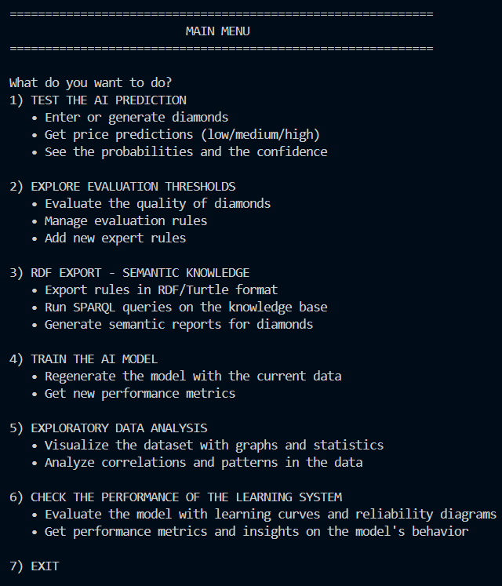

# Diamond Price Prediction & Knowledge Base Reasoning
### made by:

- [R.B.](https://github.com/Hue-Jhan)

- [A.B.](https://github.com/Antob0906)

- [S.C.](https://github.com/Stefano04Cici)

***

### ⚙ Initial setup of the work environment:

1. Create and syncronize a new virtual environment with the dependences
    ```py
    uv sync
    ```

2. Activate the virtual enviroment    
    ```
    .venv\Scripts\activate
    ```

3. Start the program
    ```py
    cd code/
    ```
    ```py
    python KB/main.py
    ```

***

## Project execution

On startup, the system presents a textual main menu that allows guiding the user based on the available functionalities:



The possible operations are:

- Test the Machine Learning prediction on diamonds by inserting or generating data and obtaining price estimates with probability and confidence level. 

- Explore and manage evaluation thresholds through the Knowledge Base, applying expert rules on the quality of diamonds.

- Export knowledge in RDF/Turtle format, with support for SPARQL queries and generation of semantic reports. 

- Retrain the AI model;

- Analyze the data in an exploratory way;

- Verify the performance of the learning system.

The execution ends by selecting the exit option from the menu.
