# 1 Introduction

The "Diamond Price Prediction & Knowledge Base Reasoning" project has the objective of integrating Machine Learning techniques with Knowledge-based systems (Knowledge Base) to support the evaluation and the estimation of the price of diamonds.

Unlike gold or silver, which have a standardized price per gram, the value of a diamond is not linear, two stones of the same weight can have drastically different prices based on subtle differences of color, purity or quality of the cut.

This subjectivity makes it difficult for an inexperienced buyer (or also for an investor) to understand if the proposed price is honest.

From here is born the idea of our project, which unlike the classic price estimators (that provide only a numerical value), the system is able to provide a reasoning on why a diamond possesses certain characteristics (e.g. rarity, excellent cut), combining the power of the ML with the transparency of the logical rules.

## 1.1 Objectives of the project

The primary objective is to develop a hybrid software application that unites two worlds of Artificial Intelligence often kept separated:

1. **Machine Learning:** To calculate precise estimates based on thousands of historical data.
2. **Knowledge Representation (Knowledge Base):** To explain the various characteristics of the stone using logical rules.

Specifically, the system offers the user a complete menu of functionalities:

- **Price Prediction:** The user enters the data (e.g. "0.5 carats, Ideal cut") and the system estimates the price range through Machine Learning techniques
- **Qualitative Analysis:** The system explains whether the diamond is "Rare", "Commercial" or "Investment-grade" through the Knowledge Base.
- **Data Simulation:** Possibility to generate random diamonds to test the market.
- **Semantic Export:** Export of the data in RDF/Turtle format for the interoperability on the Semantic Web.

## 1.2 Tools used

Below is the complete list of all the tools used in the system:

- **Python version 3.13:** Base language for the entire infrastructure;
- **Scikit-Learn:** For the Random Forest model and the training pipelines;
- **Pandas, NumPy, Scipy:** For the mathematical manipulation of the datasets;
- **Prolog (and PySwip python library):** For the definition of the logical rules;
- **RDFLib:** For the semantic web and generation of ontologies and Linked Data;
- **joblib:** For the persistence of the models;
- **Matplotlib/seaborn:** For the production of the charts.

The diagram below shows a simplified version of the system workflow taking into account the most important tools.

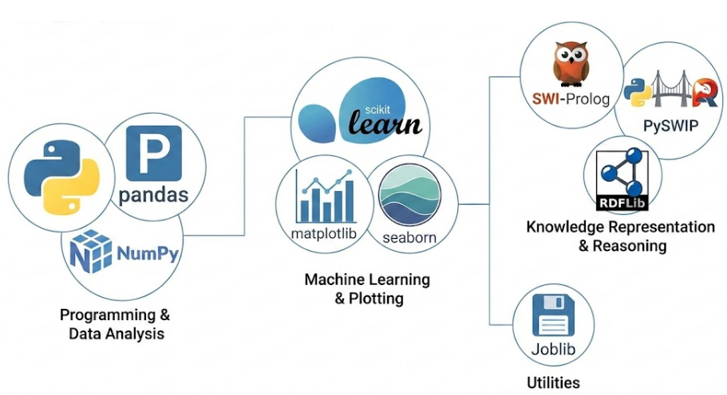

# 2) Data Analysis

In this project, the approach to data was not purely statistical, but hybrid. We operated on two levels of abstraction:

1. **Quantitative Level (Raw Data):** Represented by the raw numerical values (dimensions in mm, weight in carats, price in dollars), useful for the classic statistical analysis.
2. **Qualitative Level (Semantic Data):** Represented by discrete categories (e.g. "Low", "Medium", "High"), fundamental for the symbolic reasoning of the KB.

This required a complex preprocessing pipeline, capable of dialoguing with the Prolog engine to "label" the dataset even before submitting it to the Machine Learning algorithms.

## 2.1 Dataset

The project operates in the domain of Computational Gemmology. To simulate the reasoning of an expert, the system cannot limit itself to raw numbers, but must operate on semantic concepts. For this reason, two parallel data structures have been defined.

The starting dataset, the raw one, is the famous “Diamonds Dataset”, composed of 53.940 instances. Each instance represents a single diamond characterized by 10 attributes (features), they present numerical values and are the following (also shown in the table):

| Feature | Description |
|---|---|
| **Carat** | weight of the diamond (range: 0.2-5.01). It is the factor that most influences the price. |
| **Cut** | The quality of the cut. Order: Fair, Good, Very Good, Premium, Ideal. |
| **Color** | The color of the diamond. Order: J (worst), I, H, G, F, E, D (best). |
| **Clarity** | The purity (measure of the inclusions). Order: l1 (worst), SI2, SI1, VS2, VS1, VVS2, VVS1, IF (best). |
| **Depth** | The percentage of total depth (z / mean(x, y)). |
| **Table** | The width of the upper table of the diamond relative to the widest point. |
| **Dimensions (x, y, z)** | Length, width and depth in mm. |
| **Price (Target)** | The price in US dollars (range: 326 - 18.823). |

## 2.2 Preprocessing

As soon as the program is started, the CategoricalDataFrame class (in preprocessing.py) begins the preparation of the Data. Unlike the standard pipelines that use simple mathematical formulas, this module implements a Knowledge-based Discretization. The transformation flow happens in 4 phases:

### 1) Management of Missing Values and Cleaning

The first phase concerned the cleaning of the raw data. Although the Diamonds dataset is of high quality, we implemented some simple mechanisms to guarantee that the workflow happens without errors:

- **Use of SimpleImputer with most_frequent strategy:** If some information is missing in the file (e.g. the "color" is missing), the system automatically inserts the most common value (mode), avoiding that the program blocks.
- **Removal of null physical dimensions:** diamonds with x, y or z equal to 0 removed, as physically impossible.

### 2) Python-Prolog Integration (Logical Discretization)

Important phase, instead of using a simple Scikit-learn KBinsDiscretizer, we exploited the pyswip library to query the Knowledge Base:

1. Python reads a row from the raw dataset (e.g. price: 326);
2. Python asks Prolog how that data gets classified;
3. The corresponding Prolog rule is invoked, for example:

```prolog
price_class(Price, low) :- Price < 1000.
```

4. Prolog returns the “low” label, which is saved in the new categorical dataset.

### 3) Encoding and Transformation for Machine Learning

Given that the Machine Learning algorithms (like Random Forest) require numerical inputs, the dataset, after being cleaned and "translated”, undergoes a final transformation through ColumnTransformer:

- **Ordinal Encoding for Hierarchical Variables:** for the features like cut, color and clarity where there is a clear hierarchy (Ideal is better than Premium), we assigned increasing scores, for example Fair = 0, Good = 1. Ideal = 4.
- **One-Hot Encoding for Nominal Variables:** for features where there is no precise numerical order, we transformed the labels into binary columns (0 or 1).
- **Management of Unknown Categories:** to ensure that out-of-scale values do not cause the crash of the application but are handled in a neutral way, the encoder has been configured with handle_unknown='ignore' (or similar strategies through pipeline).

### 4) Data Splitting and Validation

Finally, the processed dataset has been divided using train_test_split into 2 groups:

- **Training Set (80%):** Used for the training of the model and for the Cross-Validation (with StratifiedKFold at 5 splits, defined in CV_SPLITS in the config.py file).
- **Test Set (20%):** Kept isolated (hold-out) for the final evaluation of the performances, used to give an impartial score to the precision of the system.

At this point, the data are clean, encoded and ready to be used in the training phase of the predictive model, which will be described in Chapter 4 (ML). Below there is a diagram that summarizes the initial pipeline, that is the logic that starts as soon as the code is started.

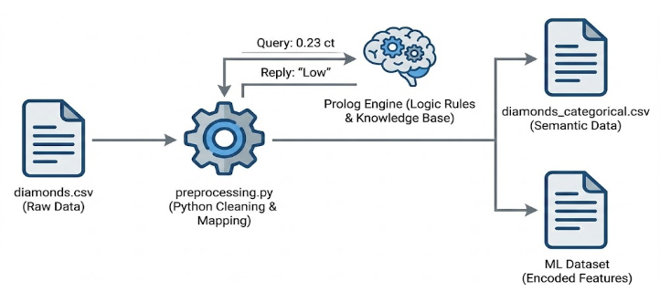

## 2.3 Exploratory analysis

In this section we visually explore the data to understand its behavior before moving to the training phase. The objective is to understand which characteristics are most important to determine the price and how the diamonds are distributed in our dataset.

### Association between the categories (Cramer's V)

Since the features have been transformed into categorical values (e.g. from 0.23 to low), it is not possible to use the classic linear Pearson correlation. We therefore calculated the Association Matrix based on Cramér's V, specific for nominal and ordinal variables.

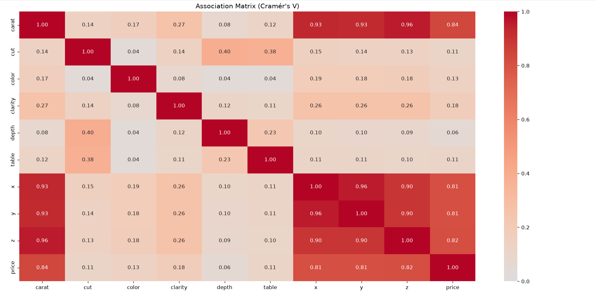

This image shows an association matrix based on Cramér's V coefficient, used to measure the intensity of the relation between the categorical variables of the diamonds dataset, with values ranging from 0.0 for no association up to 1.0 for a perfect association. From the data analysis it clearly emerges that the weight in carats and the physical dimensions x, y and z are strongly linked to each other with values comprised between 0.93 and 0.96, and they are also the factors that most influence the final price of the gem, recording association values higher than 0.80. In parallel, the quality of the cut shows a fair relation with the depth and the width of the table with values of 0.40 and 0.38, reflecting the geometric parameters used in gemmology. On the contrary, characteristics like the color and the purity present much lower association indexes both with respect to the dimensions and with respect to the price, indicating that their influence on the value of the diamond follows less direct logics and linked to qualitative evaluations.

### Distribution of the Prices

Subsequently, we analyzed how many diamonds there are for each price range.

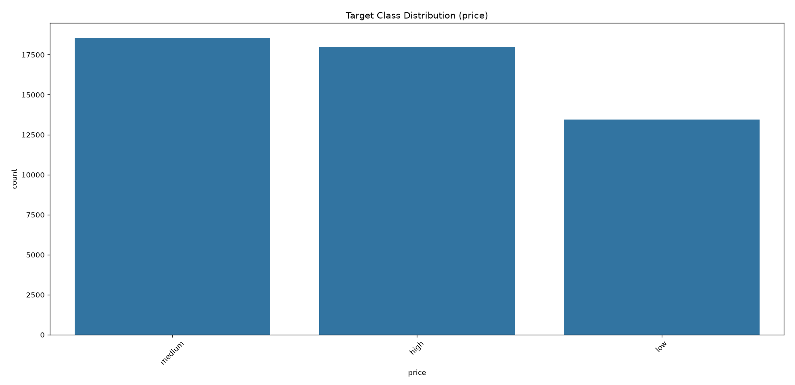

This image shows a bar chart titled "Target Class Distribution (price)" that represents the distribution of the frequency (count of the instances) among the three price classes defined in the Knowledge Base: medium, high and low. From the analysis of the chart it emerges that the medium and high classes hold the majority share and almost equal each other in volumes (with the medium range slightly higher at about 18.500 instances and the high range just under 18.000), while the low class results less represented, settling around the 13.500 instances. This configuration highlights an imbalance of the dataset caused by the thresholds established in Prolog, nevertheless guaranteeing to the model a wealth of examples in the medium-high ranges, which result the most complex to estimate

# 3) Knowledge Base (KB)

The Knowledge Base (KB) is the brain of the system. Unlike the Machine Learning, which learns from the examples, the KB contains the rules dictated by experts of this sector (gemmologists). In our project, the KB is divided in two components that work together:

1. **Logical module, in Prolog (facts_and_rules.pl):** It contains the static and universal definitions (e.g. "What does an ideal cut mean?").
2. **“Heuristic” Module, in Python, using a Threshold System (threshold_system.py):** Using the MiniKB and ExtendedKB classes it manages the procedural knowledge and uses the prolog rules to give evaluations (e.g. "This diamond is exceptional").

The two modules communicate through a middleware (pyswip), allowing the system to unite the prolog logic with the flexibility of the object-oriented programming.

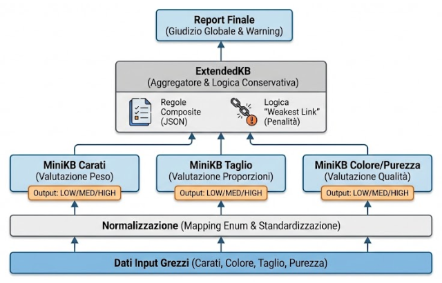

## 3.1 Rules in Prolog

The facts_and_rules.pl file defines the vocabulary of the system, here the continuous numerical values are mapped into discrete classes, we chose to use the Horn Clauses to define the properties. The main rules are structured like this:

- **Carats Classification:** Defines whether a diamond is small (low), medium or large based on the weight, for example:

```prolog
carat_class(Carat, low) :- Carat < 0.5.
carat_class(Carat, medium) :- Carat >= 0.5, Carat < 1.0.
carat_class(Carat, high) :- Carat >= 1.0.
```

**Complex Rules:** We defined more abstract concepts, that is rules that combine more attributes to identify gems of particular interest.

## 3.2 Threshold System

While Prolog returns binary answers (True/False), the commercial evaluation requires nuances, therefore for the procedural component of the Knowledge Base, instead of a Fuzzy logic (that introduces partial degrees of truth), a System Based on Discrete Threshold Rules has been implemented. The algorithm maps the continuous or categorical values into a set of discrete states (Enum), simulating the "step" classification method used by real gemmologists. The architecture of the reasoning is the following:

1. **Hierarchical Normalization:** The get_hierarchy_level function converts the categorical labels (e.g. Ideal) into numerical scores (1, 2, 3) based on the BeautyLevel Enum class, which can be of type LOW (standard characteristic), MEDIUM (good), or HIGH (excellent).
2. **MiniKB (Knowledge Unit):** Specialized classes that evaluate a single dimension (e.g. receives in input the "Ideal" cut and returns a HIGH score.).
3. **ExtendedKB (Aggregator):** It is the coordinator that analyzes the entire diamond. It combines the scores of all the characteristics, MiniKB and also external rules (loaded through JSON files like composite_rules.json) to generate a complete report. It includes a Penalty Logic, that is unlike an average, it adopts a conservative approach ("Weakest Link"), if even a single critical property (e.g. Purity) is LOW, the system generates a Warning, preventing that a large but defective diamond gets classified as excellent.

To guarantee the maintainability, the complex rules are not "hardcoded" in the Python but reside in composite_rules.json. Here is an example of how the system defines an "investment" diamond:

```json
{
"name": "Investment Grade",
"conditions": {
"carat": "high",
"clarity": "high",
"color": "high"
},
"BeautyLevel": "high"
}
```

### Example of use of the Knowledge Base

The user can query the knowledge base through option 2 of the Menu, which will bring him to the screen here on the right. Through it he can choose whether to insert the instance of a diamond manually, generate it randomly, view or insert the rules/thresholds of the knowledge base, search specific rules or save the knowledge base.

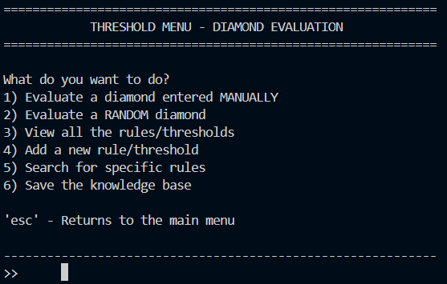

Here is an example of evaluation of a randomly generated diamond through the Knowledge Base: the system received in input a gem with high carat (elevated) and an excellent D color, but characterized by a low table and reduced surface dimensions x and y (low). Consequently, the ExtendedKB, applying its conservative logic ("Weakest Link"), assigned a low quality score (0.333 / 33.3%), since the defective proportions compromise its aesthetic yield and the brilliance despite the goodness of the other parameters.

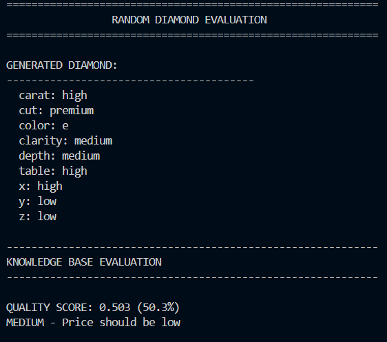

### Statistics of Activation of the Rules

The analysis of the distribution of the quality levels confirms that the conservative logic implemented in the ExtendedKB is effective, in fact only about 15% of the diamonds reaches the HIGH level, demonstrating that the system acts as a filter, valuing only the stones without critical defects (like a Fair cut or an I1 purity) that lower the overall value, realistically simulating the severity of a gemmological certification.

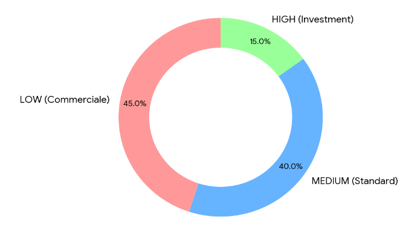

# 4) Machine Learning

## 4.1 Summary

After transforming the data and defining the business rules through the Knowledge Base, the next phase is the training of a predictive model. The problem has been modeled as a Multiclass Classification task.

The objective of the algorithm is not to estimate the exact price (which can vary for example due to unpredictable market logics), but to place the diamond in the correct value range defined by the KB: Low Value (economic range), Medium Value (standard commercial range), High Value (luxury/investment range).

## 4.2 Tools Used

The development of the Machine Learning module was based on the Python language:

- **Scikit-Learn (sklearn):** Main framework used for the construction of the pipeline. It provided the optimized implementations of the RandomForestClassifier and of the CalibratedClassifierCV for the management of the probabilities, in addition to the preprocessing tools (OneHotEncoder, OrdinalEncoder).
- **Joblib:** Fundamental for the persistence of the model. Given that the training on 50.000 instances is computationally expensive, Joblib allows to serialize (save on disk) the trained model object and reload it instantly at the start of the interface, guaranteeing immediate response times (low latency).
- **Pandas & NumPy:** Used respectively for the structured manipulation of the data (Dataframes) and for the linear algebra operations on the vectors of the features.
- **Matplotlib & Seaborn:** Libraries employed for the generation of the evaluation charts, which will be discussed in section 4.4.

## 4.3 Project decisions

During the design phase, several algorithms have been evaluated:

- **Linear Regression:** Discarded because the price of diamonds does not grow linearly (a diamond of 2 carats is worth much more than the double of one of 1 carat).
- **Support Vector Machines (SVM):** Effective, but very slow on large datasets (50k+ rows) and difficult to interpret.

However, for this task the Random Forest Classifier has been selected, and inserted inside a complex pipeline managed by the CalibratedClassifierCV class. The Random Forest is an “ensemble learning” method that builds a multitude of decision trees during the training. We chose it for various reasons, the main ones:

- **Mixed Data Management:** It works excellently with the mix of ordinal (Cut, Color) and continuous (Carats, Dimensions) features present in our dataset.
- **Feature Importance:** It allows to understand which attributes influence the decision the most (in our case the Carat is the dominant factor).
- **Resistance to Overfitting:** Thanks to the bagging technique (bootstrap aggregating), the model generalizes better on the new data compared to a single decision tree.

An important aspect of the project is the reliability of the prediction, it is not enough for us to know that a diamond is "High Value", we want to know how sure the model is of it. We encapsulated the Random Forest in a CalibratedClassifierCV, which recalibrates the predicted probabilities so that they reflect the true frequency of the classes, allowing the system to return a confidence score (e.g. "Classified High with 92% probability").

The training set has been processed through a Scikit-learn Pipeline composed of:

1. **Imputer:** Management of missing values.
2. **Encoder:** Transformation of categorical variables.
3. **Estimator:** The Random Forest model (with 100 trees, n_estimators=100).

To validate the robustness of the model, the Stratified K-Fold Cross Validation technique has been used. This ensures that every "fold" (test subset) maintains the same proportion of cheap, medium and expensive diamonds of the original dataset, avoiding statistical biases. At the end of the training, the model object (which by now contains the 'statistical knowledge') is saved in the model_path.joblib file, ready to be recalled by the user interface without having to repeat the training every time.

## 4.4 Evaluation

The validation of the model has been performed on the Test Set (20% of the dataset, about 10.800 instances), kept isolated during the training phase to guarantee the impartiality of the results. The model showed excellent performances, justified by the strong correlation between the physical characteristics (carats/purity) and the price range:

Unlike the simple Accuracy, which could be misleading, we analyzed the metrics for each single class:

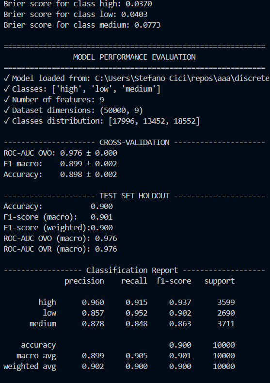

The performance on the Low class is very solid (F1 0.902) with an excellent recall (0.952). The model almost always identifies the cheap diamonds, the performance on the High class instead shows an excellent precision (0.960) and a good f1-score (0.937). This means that the model maintains a high level of reliability on the diamonds of greatest value, reaching a global accuracy of 90% on the test set.

The shown Brier scores indicate a very good level of probabilistic accuracy for all the classes, with values close to zero (where 0 represents a perfect prediction). In particular, the high (0.0370) and low (0.0403) classes obtain the best and lowest scores, confirming a high reliability and calibration of the probabilities estimated by the model for the high-end and economic diamonds, while the medium class records a slightly higher error (0.0773), consistent with the greater difficulty in delimiting the intermediate boundary zones.

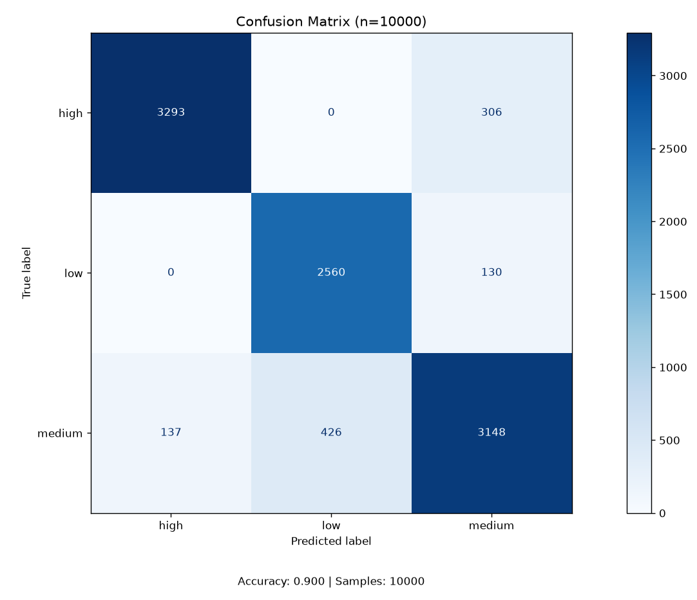

From the analysis of the Confusion Matrix it emerges that the model distinguishes with great precision the extreme classes, recording for example zero direct confusion errors between the "high" diamonds and the "low" ones, while the main errors are concentrated in the interactions with the "medium" range (like the 306 "high" diamonds classified as "medium" and the 426 "medium" diamonds mistaken for "low"), where the price boundaries are more blurred and complex. The model therefore reaches an accuracy of 90% on a test set of about 10.800 samples.

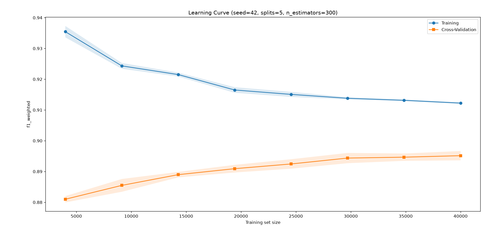

The analysis of the Learning Curves highlights that the model shows a good convergence behavior as the size of the training set increases: while the training curve decreases slightly stabilizing around 0.91, the cross-validation curve grows constantly getting closer to the training values and exceeding the 0.89 mark. This trend demonstrates that the addition of samples improves the generalization capacity of the model, progressively reducing the gap between the performances on the known data and those of validation.

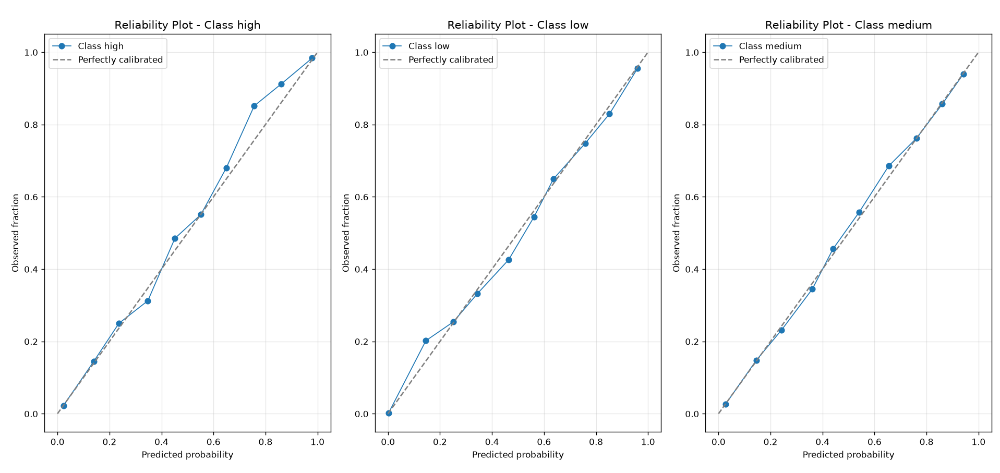

The Reliability Plots analysis has also been conducted on the final model of the project. It reveals that the model results well calibrated for all the three classes (High, Low, Medium), whose curves follow in a very close way the ideal diagonal that represents the perfect correspondence between predicted probabilities and observed fractions. This indicates that the model correctly estimates the levels of confidence and uncertainty in the predictions. The stability of the curves confirms the effectiveness of the training and the general robustness reached thanks to the expansion of the dataset during the design phases

# 5) Semantic Web (RDF)

## 5.1 Summary

The Semantic Web module has the objective of transforming the symbolic Knowledge Base of the system into a formal, interoperable and queryable representation, using the standard technologies of the Semantic Web, in particular RDF (Resource Description Framework) and SPARQL. Through this component, the project allows the export and the reuse of the knowledge in external contexts, the execution of advanced semantic queries and the generation of RDF reports specific for single diamonds.

## 5.2 Tools Used

For the implementation of the semantic level, RDF (Resource Description Framework) has been used as tool and standard, used as data model to represent the characteristics of the diamonds, evaluation thresholds, simple rules, composite rules, appreciation levels (LOW, MEDIUM, HIGH) and the metadata of the Machine Learning model.

The adopted serialization is Turtle (.ttl), chosen for its readability and diffusion.

SPARQL, the standard language for the querying of the RDF graphs, has been used to recover rules per characteristic, analyze the structure of the Knowledge Base, obtain semantic statistics, and recover specific patterns (e.g. "Find all the rules that define an excellent diamond").

The RDFLib Python Library (Python) has been used to create RDF graphs, serialize and deserialize .ttl files, execute SPARQL queries, manage namespaces and light ontologies.

As for the Standard ontologies, we used integrations of known vocabularies like schema.org (for generic entities), foaf (for agents) and dc (Dublin Core for metadata).

## 5.3 Project Decisions

The RDF module has not been conceived as a simple file converter, but as an integration level that unites the two faces of the system: the statistical prediction (ML) and the logical reasoning (KB). The system offers a complete set of tools for the management of the semantic life cycle, accessible through a dedicated menu. The main design decisions concern the formal definition of the vocabulary and the implementation of the operational export and traceability functionalities. To guarantee that the data are understandable by other software systems (interoperability), we adopted a hybrid approach in the definition of the terms:

1. **Standard Ontologies:** We reused worldwide vocabularies for the generic concepts: schema.org (schema:), to define the software model and the generic data, and Dublin Core (dc:), for the metadata like descriptions and dates.
2. **Custom Namespace:** For the specific concepts of our domain that do not exist in the standards, we created the namespace http://example.org/diamonds# (ex: prefix).

The system implements these operations to transform the raw data into structured semantic knowledge:

### Generation of the RDF report

A key functionality implemented in the generate_diamond_rdf_report function is the dynamic creation of a graph for each single prediction. When the user analyzes a diamond, the system generates a .ttl file that unites three sources of data:

- **Physical Data:** The 4Cs inserted by the user (Carat, Cut, Color, Clarity).
- **Predictive Data:** The price estimated by the Random Forest and the associated confidence.
- **Model Metadata:** The graph includes a reference to which model performed the estimate (e.g. model_random_forest with accuracy=0.96), this guarantees the traceability (Provenance) of the decision.

The generated .ttl (turtle) file represents a graph of nodes and edges, the software does not automatically generate an image, but to visualize the graph one must use external tools.

### Export of the Knowledge Base and ML Integration

The system is capable of "exporting itself", through the kb_to_rdf function, which reads the internal rules of the Threshold System and translates them into static RDF triples.

Here is an example of a simplified RDF schema that depicts how the diamond (center) is connected to the physical data (left, orange) and to the predictive/model data (right, green):

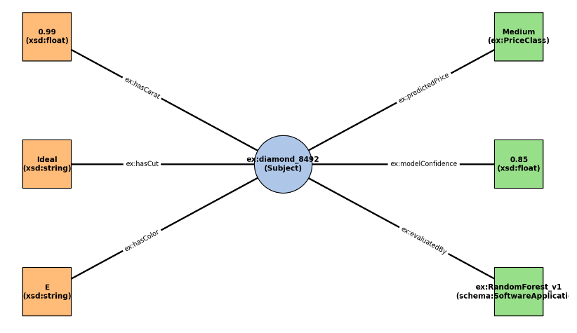

## 5.4 Evaluation

To verify that the semantic level was coherent and free of errors, we used SPARQL, the standard language for the querying of the RDF graphs. The queries have been integrated directly in the menu of the application. In the test below the objective of the test was to verify whether the system could answer complex questions about its own internal knowledge, for example: "Which rules define an excellent diamond?".

The following query is launched:

```sparql
PREFIX ex: <http://example.org/diamonds#>
SELECT ?name ?feature ?operator ?value
WHERE {
  ?rule ex:ruleName ?name .
  ?rule ex:indicatesBeautyLevel ex:HIGH .
  ?rule ex:hasCondition ?condition .
  ?condition ex:appliesToFeature ?feature ;
             ex:thresholdOperator ?operator ;
             ex:conditionValue ?value .
}
```

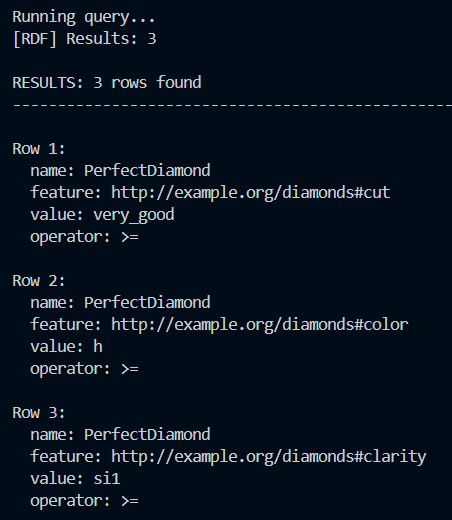

The execution of the query through the RDFLib engine produced the following result, confirming that the ontological structure is correct and queryable:

Finally, to guarantee the integrity of the data, the system allows to reload a previously saved graph, verifying that the file is intact and readable (Round-Trip Serialization).

# 6) Conclusions

The hybrid approach proved to be winning compared to the traditional methods:

1. **Precision:** The Random Forest guarantees a statistical accuracy of 90% in the classification of the price ranges.
2. **Explainability:** The use of Prolog and of the Threshold System provides that level of semantic understanding that is lacking in the only numerical algorithms. The system does not limit itself to giving an output, but "argues" its decision analyzing the quality of the cut and the rarity of the stone.
3. **Scalability:** The modular structure of the code allows to update the market rules (e.g. change the price thresholds in Prolog) without having to implement burdensome modifications to the code.

In conclusion, the system represents a valid prototype of Decision Support System (DSS) for the gemmological sector, capable of assisting both an expert user and a novice in the evaluation of a diamond.

## 6.1 Future Developments

To further improve the system, the following developments are hypothesized:

- **Web Graphical Interface:** Porting the CLI on a Web App (using Flask or Streamlit) to make it accessible from browser.
- **Prices API Integration:** Connecting the system to the real-time APIs of the diamonds market (e.g. Rapaport Price List) to update the price ranges dynamically.
- **Computer Vision:** Integrating an image analysis module to automatically extract the characteristics (cut, color) from a photo of the diamond, automating the input of the data

# 7) Bibliographic References

1. **Dataset:** Diamonds Dataset, Kaggle, (https://www.kaggle.com/datasets/shivam2503/diamonds) Ggplot2 library references;
2. **Machine Learning:** Scikit-learn Documentation (RandomForest, CalibratedClassifierCV, https://scikit-learn.org/stable);
3. **Prolog Integration:** PySWIP Documentation & Logic Programming with Prolog (Bratko), PySwip official website (https://pypi.org/project/pyswip/);
4. **Knowledge Engineering:** Russell, S., & Norvig, P. Artificial Intelligence: A Modern Approach. (Chapters on Knowledge Representation).
5. **RDFLib Documentation:** RDFLib 7.6.0 official documentation, the de facto standard library for RDF in Python. Available at: https://rdflib.readthedocs.io/en/stable/.
6. **W3C Standards:** Resource Description Framework (RDF) and SPARQL Query Language specifications. Available at: https://www.w3.org/RDF/
7. **Video Resources and Tutorials (YouTube):** StatQuest with Josh Starmer: Fundamental resource for the visual understanding of the Machine Learning algorithms used, in particular for the functioning of the Random Forests, of the ROC Curves and of the Confusion Matrix); FreeCodeCamp.org (Python & Data Science): Complete courses for the implementation of the Machine Learning and Data Preprocessing pipelines in Python.
